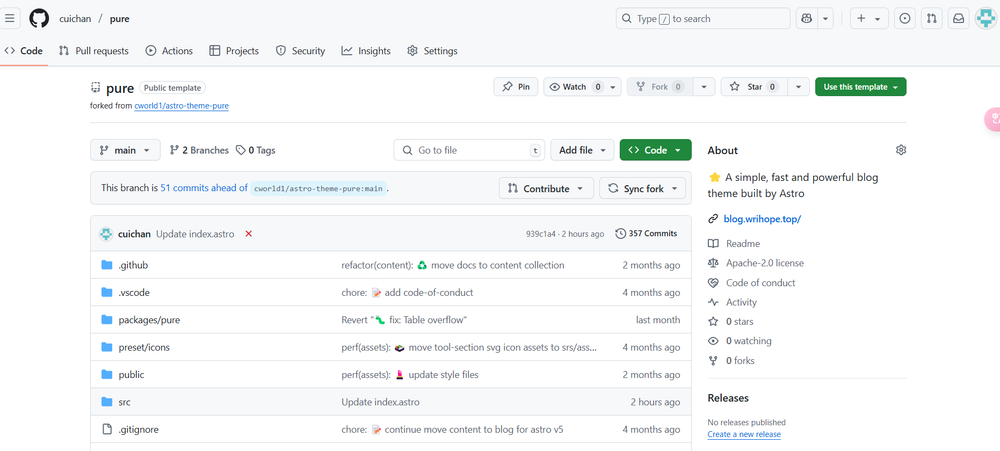

### 选择原因

Astro博客是一款非常轻量级的博客并且界面非常美观，个人非常喜欢，在经历博客园、Halo博客之后决定选择其为个人博客基础框架（最大原因是完全免费，虽然我的博客用到了域名，但是vercel自己分配的域名也可以通过托管到cf上实现国内访问，不过自动分配的域名太难看了）。

一开始疯狂在论坛上寻找，但是大多都需要利用服务器进行托管，搜索得知阿里云最近有38一年的服务器遂去蹲点，奈何手速太慢根本抢不到，于是乎找到了这款不错的博客框架，虽然修改成自己想要的样子不太容易（因为不太理解前端代码，不过貌似读着和Vue框架有些相似？），不得已搬出Deepseek和Claude老祖，二人协同合作助我完成建博大业。

附上地址[搭建一个属于自己的 Astro 博客网站 —— 内附视频教程](https://linux.do/t/topic/316749)
### 搭建过程

 1. 去[官网](https://astro.build/themes/)找一个自己喜欢的主题，我选择的主题为[Pure主题](https://github.com/cworld1/astro-theme-pure)
 2. Fork自己喜欢的主题到自己的仓库，如图所示
 

 3. 引入你的项目至[Vercel](https://vercel.com/)
 4. 
