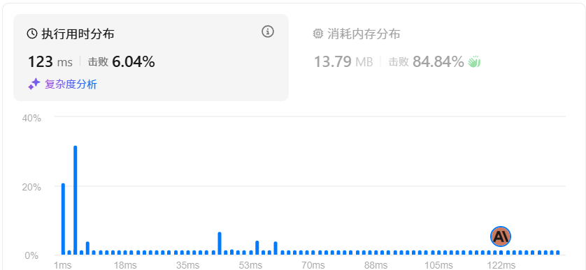

## 问题描述
给定一个整数数组 `nums` 和一个整数目标值 `target`，请你在该数组中找出 **和为目标值** _`target`_  的那 **两个** 整数，并返回它们的数组下标。

你可以假设每种输入只会对应一个答案，并且你不能使用两次相同的元素。

你可以按任意顺序返回答案。

**示例 1：**

**输入：** nums = [2,7,11,15], target = 9
**输出：** [0,1]
**解释：** 因为 nums[0] + nums[1] == 9 ，返回 [0, 1] 。

**示例 2：**

**输入：** nums = [3,2,4], target = 6
**输出：** [1,2]

**示例 3：**

**输入：** nums = [3,3], target = 6
**输出：** [0,1]

**提示：**

- `2 <= nums.length <= 104`
- `-109 <= nums[i] <= 109`
- `-109 <= target <= 109`
- **只会存在一个有效答案**

**进阶：** 你可以想出一个时间复杂度小于 `O(n2)` 的算法吗？

## 思路
看到题目第一想法是~~不能使用两个for循环~~，看到数据范围是10的四次方，于是乎想到的是利用**哈希表**去存储每个数字的位置，但是实际运行发现，会有重复值覆盖掉其他位置，经过调试发现失败，最终不得已（~~暴力万岁）~~，但是这种想法应该是正确的，~~据传算法优化的起点便是从暴力开始~~（不是我说的）！

## 优化过程

看官方题解发现，果不其然利用的哈希表。还是本菜狗功夫不到家🏠，菜就多练。
经验证，是判断有误，被覆盖掉了，以下是官方题解：
```c++
if(a.count(target-nums[i])>0&&(a[target-nums[i]]!=i))
            //判断是否找到目标元素且目标元素不能是本身
```

这一步判断失误，太可惜了，希望自己可以记住
## 时间复杂度

$$
O(n^2) 
$$

## AC代码


```C++
class Solution {

public:

    vector<int> twoSum(vector<int>& nums, int target) {

        int len = nums.size();

        vector<int> ans;

        for(int i=0;i<len;i++){

            for(int j=i+1;j<len;j++){

                if(nums[i]+nums[j]==target){

                    ans.push_back(i);

                    ans.push_back(j);

                    return ans;

                }

            }

        }

        return ans;

    }

};
```
